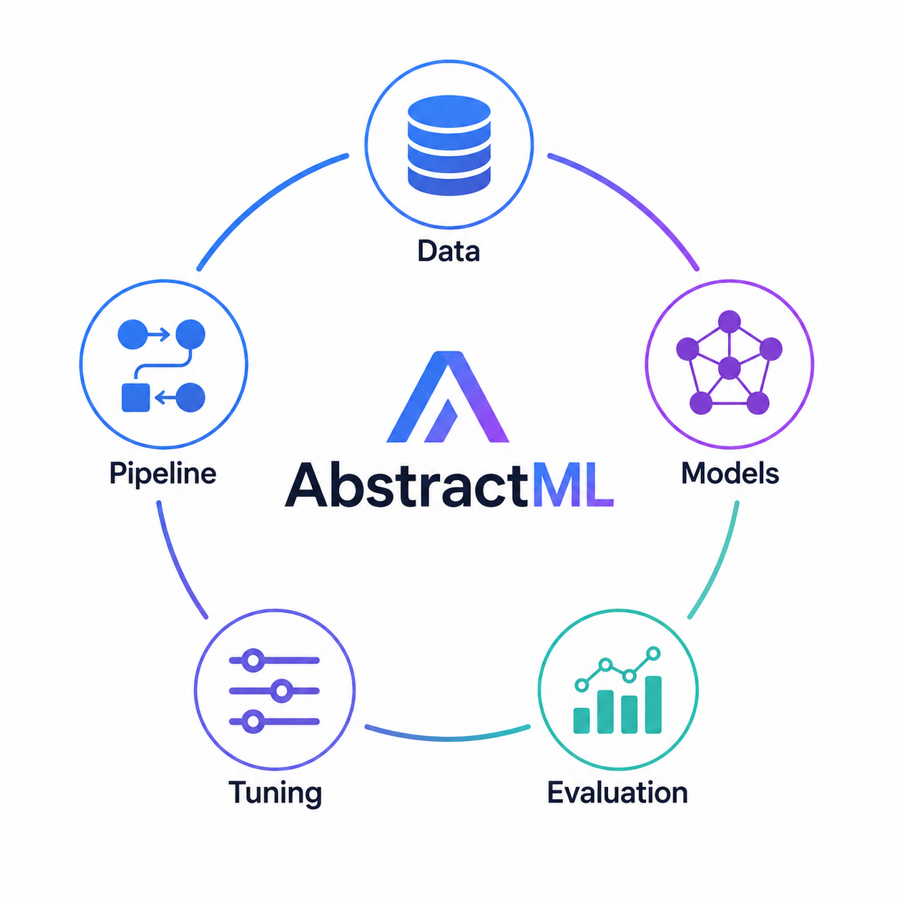

<div align="center">

# AbstractML
A small, abstracted ML toolkit to make it easy to perform ML Tasks/code.<br/>

</div>


## Purpose
My entire life i felt like most information on the intertnet and documentations/instructions create more of a mess than to actually explain things. i like to keep things simple. 
<br/>
<br/>
1 simple sentence can beat entire books of information. Same way 1 line functions should be abstracting some ML tasks to hide complexity and Boilerplate code..


The project is organized by purpose: <br/>`Data/` handles datasets, EDA, plots, and preprocessing; <br/>`Models/` handles estimators; <br/>`Evaluation/` handles metrics;<br/>`Tuning/` fine tuning functions/pipelines;  <br/>`Pipeline/` Construct entire Pipelines of the previosuly listed functions easily with Pipeline/ Module  <br/>`Core/` holds shared utilities.

## Example

```python
from Data import setActiveDataset, describeData
from Models import selectModel, trainModel
from Evaluation import evaluateModel

#__________________ Setup __________________
downloadDataset(name="iris",source="sklearn",outputPath="Datasets",saveAs="iris_dataset",)
setActiveDataset("iris_raw")  #this says hey we are talking about this Dataset from now on.


#__________________ Exploratory Data Analysis __________________
describeData()
viewHead(n=10)
#viewSample(n=20)  #randomly selects and views n rows
#viewSchema()      # how many rows and cols?


#__________________ Preprocessing __________________
dropMissing(columns=None,threshold=None)    #Removes missing data based on what cols, threshold u specify.
scaleData(method="standard",columns=None)  #Scales numeric columns.  normalizes numbers.
#encodeTarget(y,method="label")   #Encodes the target labels separately.


#__________________ Feature Engineering __________________
createFeature(name="sepalRatio",expression="sepal_length / sepal_width")  #Creates a new column from existing columns.
#binColumn(column="sepal_length",bins=3,newColumn="sepalLengthBin")   #temperature -> cold/medium/hot.
#combineColumns(columns=["domain","model"],newColumn="domainModel") #Merge columns into one feature.


#__________________ Model Selection/Training __________________
model = selectModel(name="logistic_regression", max_iter=1000)
trained = trainModel(model=model, target="target")


#__________________ Evaluation __________________
print(evaluateModel(trained=trained))


#__________________ Fine Tuning __________________


#__________________ Pipeline __________________
```

## Status

Early development. See `RULES.md` for structure and conventions.